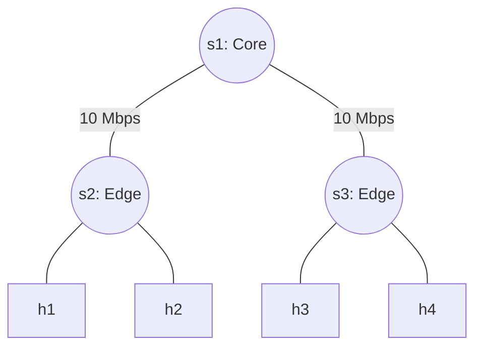

# Lab 02: Mininet Python API

## Overview
While the Mininet CLI is great for predefined topologies, real-world network experiments require custom configurations. In this lab, you will use the **Mininet Python API** to programmatically build a specific topology.

## Topology Description
We want to build a hierarchical network with:
- One core switch: `s1`
- Two edge switches: `s2` and `s3`, both connected directly to the core switch `s1` with **10 Mbps** bandwidth-constrained links.
- Two hosts connected to `s2` (`h1`, `h2`) with unconstrained gigabit links.
- Two hosts connected to `s3` (`h3`, `h4`) with unconstrained gigabit links.



## Setup
Start the Docker container for this lab:
```bash
docker compose up -d
docker exec -it asdn_mininet_lab02 /bin/bash
```

## Tasks

### Task 1: Complete the Topology Script
Open the `custom_topo.py` file provided in this folder. It contains a boilerplate `CustomTopo` class.

1. Locate the `# Add switches` section and use `self.addSwitch('name')` to add `s1`, `s2`, and `s3`.
2. Locate the `# Add hosts` section and use `self.addHost('name')` to add `h1` through `h4`.
3. Locate the `# Add links` section and use `self.addLink(node1, node2, **params)` to wire the network together. 
   *(Hint: specify `bw=10` when linking the switches to create the bottleneck).*
4. At the bottom of the script, instantiate the `Mininet` object, start it, run the `CLI(net)`, and stop it.

### Task 2: Validate the Network
1. Inside the container, execute the script:
   ```bash
   python3 custom_topo.py
   ```
2. You will jump into the Mininet CLI automatically.
3. Validate full connectivity:
   ```bash
   mininet> pingall
   ```
4. Verify the bandwidth constraint by testing speed between an `s2` host and an `s3` host:
   ```bash
   mininet> iperf h1 h3
   ```
   You should see the throughput capping precisely at ~10.0 Mbits/sec.

*If you run into issues, check the `solutions/` folder for the completed script.*
