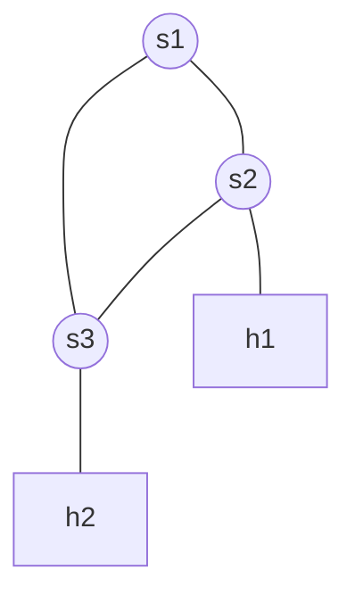

# Lab 05: Manual OpenFlow Routing

In this final lab of the introductory OpenFlow section, we will combine the skills you acquired in Lab 02 (Python API) and Lab 03 (`ovs-ofctl`). Your goal is to load a custom topology with NO controller, and manually insert the correct OpenFlow rules to allow two hosts to communicate over a specific physical path.

## Topology
We will use a "Triangle" topology:
- `s1` is connected to both `s2` and `s3`.
- `s2` is connected to `s3`.
- `h1` is attached to `s2`.
- `h2` is attached to `s3`.



## Setup
```bash
docker compose up -d
docker exec -it asdn_mininet_lab05 /bin/bash
```

## Tasks

### Task 1: Start the Custom Topology
1. A starter script `triangle_topo.py` is provided in this folder. It already defines the switches and links, but lacks the network instantiation.
2. Complete the `triangle_topo.py` script so that it initializes Mininet with NO controller: `Mininet(topo=topo, controller=None)`.
3. Execute the script:
   ```bash
   python3 triangle_topo.py
   ```
4. Try to ping. Verify that `pingall` completely fails since the switches have no flow rules.

### Task 2: Analyze the Ports
To create static flows matching `in_port`, you need to know which port number corresponds to which physical link on your switches.
1. Open a **second terminal** on the container:
   ```bash
   docker exec -it asdn_mininet_lab05 /bin/bash
   ```
2. Find the port mappings by running the `net` command inside the Mininet CLI (Terminal 1).
3. Alternatively, dump the ports directly via OVS in Terminal 2:
   ```bash
   ovs-ofctl show s2
   ovs-ofctl show s3
   ```
   Take note of the port number that connects `h1` to `s2`, and the port that connects `s2` to `s3`.

### Task 3: Establish the Preferred Path
We want to route traffic from `h1` to `h2` **directly** via the direct link between `s2` and `s3` (bypassing `s1` entirely).
1. In your second terminal, use `ovs-ofctl add-flow` on `s2` to forward packets from `h1` directly out the port pointing to `s3`.
2. Use `ovs-ofctl add-flow` on `s3` to forward packets arriving from `s2` directly out to `h2`.
3. Crucially, do the exact same for the return path (`h2` -> `s3` -> `s2` -> `h1`). ICMP echo implies a two-way street!

### Task 4: Ping Verification
Run the ping in Terminal 1:
```bash
mininet> h1 ping -c 3 h2
```
If your flow table entries are correct, the ping will succeed.

### Advanced Task (Optional)
Try routing the traffic via `s1` (`h1` -> `s2` -> `s1` -> `s3` -> `h2`). You will need to flush the old rules first:
```bash
ovs-ofctl del-flows s2
ovs-ofctl del-flows s3
```
Then inject the new rules into all three switches (`s1`, `s2`, `s3`).
