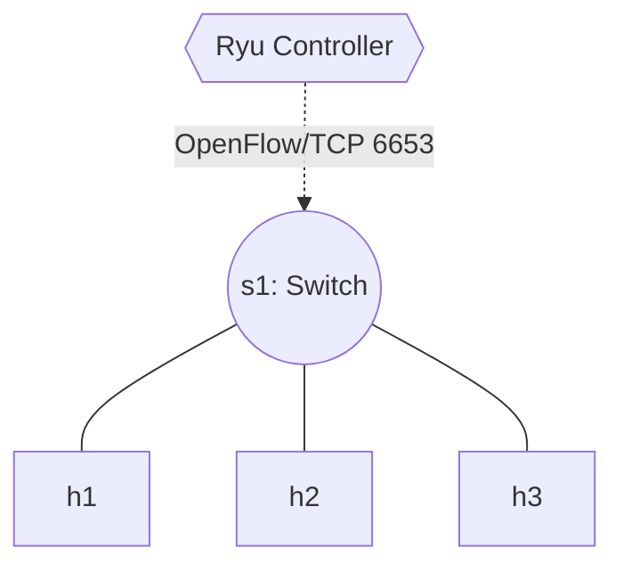

# Lab 06: Your First SDN Controller (Ryu Hub)

Now that you understand the OpenFlow messages (`PACKET_IN`, `PACKET_OUT`), it's time to build the "brain"! We will use the **Ryu SDN Framework**, a powerful component-based software-defined networking framework designed in Python.

In this lab, you will write a controller that turns our advanced OpenFlow switch into a basic **Hub**. A Hub takes any packet it receives on an interface and blindly floods (broadcasts) it out of all other active ports.

## Topology
We will use a simple single-switch topology with 3 hosts.



## Setup
In this lab, you will use Mininet to create the data plane, and Ryu in a separate terminal to run the control plane. Start your container:
```bash
docker compose up -d
docker exec -it asdn_mininet_lab06 /bin/bash
```

## Tasks

### Task 1: Complete the Ryu Application
1. Open the starter script `ryu_hub.py`.
2. Locate the `_packet_in_handler` function. The Ryu decorator `@set_ev_cls` automatically triggers this function every time the switch sends a `PACKET_IN` message to the controller.
3. We need to tell the switch to flood the packet. We do this by constructing a `PACKET_OUT` message, specifying the action `OFPP_FLOOD`.
4. Follow the `TODO` comments.

### Task 2: Launch and Verify
1. Open **Terminal 2** inside the container:
   ```bash
   ryu-manager ryu_hub.py
   ```
2. In **Terminal 1**, run Mininet, explicitly telling it to connect to your remote custom controller:
   ```bash
   mn --topo single,3 --controller remote
   ```
3. Test connectivity. In Mininet, run `h1 ping -c 3 h2`. It should succeed.
4. But are we actually acting as a Hub? Run `xterm h3` from Mininet to open a terminal for `h3`. Inside `h3`, run `tcpdump -i h3-eth0` to sniff traffic.
5. In Mininet, run `h1 ping h2` again. You will see the ICMP packets miraculously appearing on `h3`'s capture! Our switch is officially acting like a dumb Hub.
