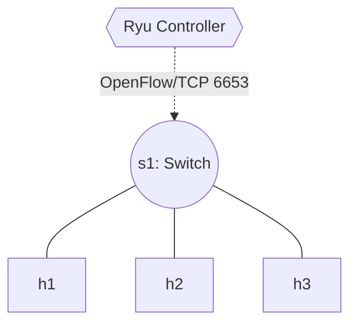

# Lab 07: Layer 2 Learning Switch

A Hub (from Lab 06) is incredibly inefficient because every packet is flooded everywhere. In this lab, you will turn our switch into a smart **L2 Learning Switch**. It will map the MAC addresses of connected hosts, and when it knows the destination, it will send the packet *only* out of the specific correct port. 

Crucially, it will also inject a `FLOW_MOD` rule directly into the switch's hardware flow tables. This ensures that all subsequent packets for that path bypass the controller entirely, achieving line-rate speeds!

## Topology
Same as Lab 06: A single switch with 3 interconnected hosts.



## Setup

First, start the container background:
```bash
docker compose up -d
```

In **Terminal 1** (The Data Plane), start Mininet:
```bash
docker exec -it asdn_mininet_lab07 mn --topo single,3 --controller remote
```

In **Terminal 2** (The Control Plane), start Ryu:
```bash
docker exec -it asdn_mininet_lab07 ryu-manager /lab/ryu_learning_switch.py
```

## Tasks

### Task 1: Complete the Learning Switch Logic
1. Open the starter script `ryu_learning_switch.py`.
2. Notice we now possess a `self.mac_to_port` dictionary instantiated in the `__init__`.
3. Every time a `PACKET_IN` arrives, record the Source MAC address (`src`) and the Port it arrived on (`in_port`) into the dictionary.
4. Check if the Destination MAC address (`dst`) is already recorded in your dictionary.
   - If **yes**, set the output action to that specific port.
   - If **no**, set the output action to flood (`OFPP_FLOOD`), because we don't know where it lives yet.

### Task 2: Inject Flow Rules (`FLOW_MOD`)
1. If you know the destination port, it's terribly inefficient to keep asking the controller for every single packet of a TCP stream.
2. In the code, construct an `OFPFlowMod` message using `parser.OFPFlowMod`. We provided a complete example of how to organically construct an `OFPMatch` and `OFPFlowMod` since this is your first time seeing it.
3. Use `datapath.send_msg()` to inject this permanent rule into the hardware.

### Task 3: Verification
1. Run `h1 ping -c 3 h2` in Terminal 1. It should succeed.
2. Sniff traffic on `h3` (`xterm h3`, then `tcpdump -i h3-eth0`). Run the ping from `h1` to `h2` again. `h3` should **NO LONGER** receive the ICMP traffic, proving your controller successfully taught the switch how to route privately!
3. On Terminal 2, pause/stop the `ryu-manager` using `Ctrl+C`. Use `ovs-ofctl dump-flows s1`. You should witness the concrete OpenFlow rules your controller injected!
