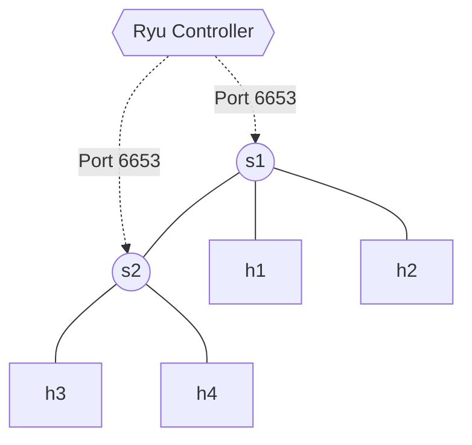

# Lab 08: SDN Firewall

In this lab, you will extend your standard L2 learning switch with **Firewall** capabilities. In traditional networks, a firewall has to intercept and inspect every packet. Using OpenFlow, you can push the drop policy directly into the switch hardware! An OpenFlow rule with an empty `actions` list implicitly instructs the switch to **DROP** the packet silently and instantly.

## Topology
We will use a linear topology with 2 switches and 2 hosts each.


## Setup
In **Terminal 1**:
```bash
docker compose up -d
docker exec -it asdn_mininet_lab08 mn --topo linear,2 --controller remote
```
In **Terminal 2**:
```bash
docker exec -it asdn_mininet_lab08 ryu-manager /lab/ryu_firewall.py
```

## Tasks
1. The script has a `BLOCKED_IP = "10.0.0.3"` (which corresponds to `h3`).
2. We have imported the `ipv4` packet parser from `ryu.lib.packet`.
3. If the parsed IPv4 packet originates from `10.0.0.3`, construct an empty actions list `[]`.
4. We provided the example for `OFPMatch(eth_type=0x0800, ipv4_src=BLOCKED_IP)`. When matching IPs in OpenFlow, you must *always* specify the ethernet type (`0x0800` for IPv4).
5. Inject a `FLOW_MOD` with the given empty actions list and a **higher priority** (e.g., `100`) than your normal learning switch rules. 
6. Complete the rest of the script with a basic L2 learning switch (from Lab 07) to allow everyone else to communicate.
7. Run `pingall` in Mininet. `h3` should fail to reach everyone, but `h1`, `h2`, and `h4` will communicate perfectly.
