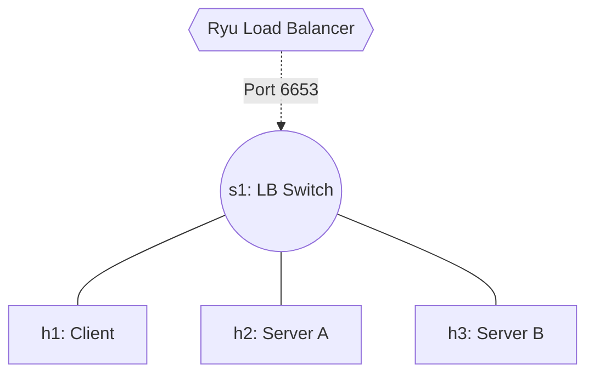

# Lab 09: SDN Route Rewriting / Load Balancer

Traditional load balancers act as inline proxy bottlenecks. SDN allows us to perform high-speed Load Balancing by utilizing the switches themselves to rewrite `.ipv4_dst` packets on the fly (like a distributed NAT).

## Topology
1 Switch acting as a load-balancer, 1 Client (`h1`), 2 Backend Servers (`h2`, `h3`). 
The client natively aims for a Virtual IP (VIP) and the switch rewrites the destination to target real servers in a round-robin format.



## Setup
In **Terminal 1**:
```bash
docker compose up -d
docker exec -it asdn_mininet_lab09 mn --topo single,3 --controller remote
```
In **Terminal 2**:
```bash
docker exec -it asdn_mininet_lab09 ryu-manager /lab/ryu_loadbalancer.py
```

## Tasks
1. `h1` will try to ping a virtual IP: `10.0.0.100`.
2. When the packet hits the controller, the controller uses a `round_robin` counter to pick the real destination (either `h2: 10.0.0.2` or `h3: 10.0.0.3`).
3. We have provided `parser.OFPActionSetField(ipv4_dst='10.0.0.2')` as an example. This instructs the hardware switch to forcefully overwrite the packet IP header in real-time.
4. Implement the remaining logic in the provided python file to ensure that ICMP echo replies coming *from* the backend servers get rewritten back from their real IP to the VIP `10.0.0.100`, otherwise `h1` will reject the replies.
