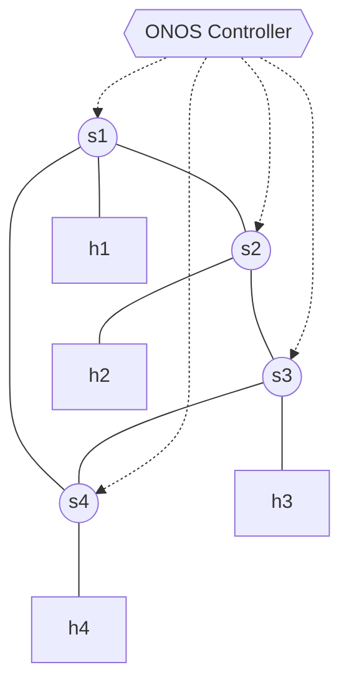

# Lab 10: ONOS Introduction & GUI

Moving away from the educational Python frameworks, we will now explore **ONOS** (Open Network Operating System) — a carrier-grade, highly scalable SDN Operating System. ONOS runs as a standalone Java application cluster and exposes a powerful Web GUI and comprehensive REST APIs.

## Topology
We will utilize a simple ring topology with 4 switches, each having 1 appended host.



## Setup

Start the ONOS and Mininet containers. This time, `docker-compose` provisions an isolated Docker network so both containers can reach each other via DNS.
```bash
docker compose up -d
```
*[!] Wait ~60 seconds for ONOS's JVM to fully boot up and activate its sub-applications.*

## Tasks

### Task 1: Connect Mininet to ONOS
1. Attach to the Mininet container:
   ```bash
   docker exec -it asdn_mininet_lab10 /bin/bash
   ```
2. Start Mininet, explicitly pointing the controller to the `onos` container DNS name on port `6653`:
   ```bash
   mn --topo ring,4 --controller=remote,ip=onos,port=6653
   ```
3. Run `pingall` in Mininet. Doing this forces the hosts to emit ARP packets. The ONOS default `fwd` capability captures these ARPs and learns where the hosts are connected. Everything should succeed automatically.

### Task 2: Explore the ONOS GUI
1. On your host machine's browser, navigate to: `http://localhost:8181/onos/ui`
2. **Login Credentials**: 
   - Username: `onos`
   - Password: `rocks`
3. Click around the topology view. You should see all 4 switches modeled dynamically!
   *Hint: Try pressing `H` on your keyboard while selecting the canvas to toggle host visibility.*

### Task 3: Karaf Console (Optional)
ONOS runs atop the Apache Karaf OSGi framework. You can interface with its underlying OS.
1. In a new terminal on your host, `ssh` into the ONOS control console (password is `rocks`):
   ```bash
   ssh -p 8101 karaf@localhost
   ```
2. Run commands like `devices` to list connected hardware OpenFlow switches, or `hosts` to see the globally learned MACs.
