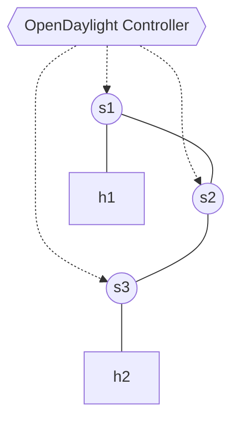

# Lab 12: OpenDaylight (ODL) Basics

OpenDaylight (ODL) is one of the most prominent open-source SDN controllers, heavily adopted by the telecommunications industry. Unlike ONOS or Ryu, ODL is extremely modular. When you boot it out of the box, it literally does nothing until you install specific "Features" via its Karaf console.

## Topology
We will use a linear topology with 3 switches.


## Setup
Start the environment:
```bash
docker compose up -d
```
*[!] Note: ODL is a massive Java application. It might take 1-2 full minutes to boot, especially on the first run.*

## Tasks

### Task 1: Install ODL Features via Karaf
1. Open your host terminal and Attach to the ODL Karaf console via SSH (password is `karaf`):
   ```bash
   ssh -p 8101 karaf@localhost
   ```
2. By default, ODL doesn't even know what OpenFlow is. Install the necessary modules:
   ```bash
   opendaylight-user@root> feature:install odl-restconf odl-l2switch-switch
   ```
   *This commands ODL to dynamically load the REST API framework and a basic L2 Learning Switch routing mechanism.*

### Task 2: Connect Mininet
1. Open a new terminal and attach to the Mininet container:
   ```bash
   docker exec -it asdn_mininet_lab12 /bin/bash
   ```
2. Start the network pointing to ODL (port `6653`):
   ```bash
   mn --topo linear,3 --controller=remote,ip=opendaylight,port=6653
   ```
3. Run `pingall`. Since you explicitly installed `odl-l2switch-switch` in Karaf, ODL automatically provides reactive forwarding, and the ping will comfortably succeed.

### Task 3: Query the RESTCONF API
ODL organizes its data using structured YANG models accessible via RESTCONF. 
1. Open the provided `get_topology.py` script. It uses `requests.get()` pointing to ODL's operational network-topology endpoint.
2. Complete the `TODO` to parse the returned JSON payload and extract the total number of connected nodes.
3. Run the script from inside the Mininet container:
   ```bash
   python3 /lab/get_topology.py
   ```
4. This is functionally how external orchestration microservices "read" the network state in production!
