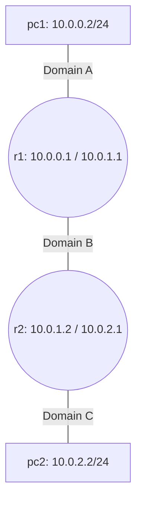

# Lab 13: Kathará Routing Basics

We are finally stepping out of the Mininet SDN world and into **Kathará**, a lightweight container-based network emulation system natively designed for complex IP routing and network design. Unlike Mininet which simulates a single logical datapath, Kathará reads a declarative configuration file and spins up entirely independent Docker containers for each router, switch, or PC.

## Topology
We will route between two isolated networks (`pc1`, `pc2`) through two intermediary routers (`r1`, `r2`).



## Setup
Unlike our previous Python-based OpenFlow labs, we do **NOT** use `docker-compose` here. Kathará essentially acts as its own orchestrator to manage Docker seamlessly.

Make sure [Kathará](https://www.kathara.org/) is installed locally on your host OS. To start the entire lab architecture, navigate to this folder and simply run:
```bash
kathara lstart
```
Once initialized, Kathará will automatically pop open individual colored terminal windows for every single device!

## Tasks

### Task 1: Complete the Topology (`lab.conf`)
1. Open `lab.conf`. This is the brain of the Kathará topology, dictating which device is connected to which broadcast domain (like a virtual switch).
2. We provided the initial example: `r1[0]="A"`, which connects `eth0` of router `r1` to the collision domain `A`.
3. Complete the `TODO`s to attach all the remaining devices and interfaces to `A`, `B`, and `C` based on the mapping in the Mermaid diagram.

### Task 2: Addressing & Routing (`.startup` files)
1. Open `r1.startup`. This bash script is executed silently by the Linux kernel when `r1` boots up. We provided the example command `ip addr add ...` to statically assign an IP.
2. Complete the IP assignments for `r1`'s other interface.
3. Open `pc1.startup`. Assign the IP. We also need `pc1` to know how to reach the outside world. Add the `ip route add default via ...` routing command pointing to `r1`.
4. Proceed similarly for `r2.startup` and `pc2.startup`.
5. Finally, `r1` and `r2` need static routes to find the networks they are *not* directly attached to. We provided the explicit `ip route add ...` example in `r1.startup`. Execute the mirror version in `r2`.

### Task 3: Verification
1. Run `kathara lstart` (or `kathara lrestart` if you were already running it).
2. When the terminal for `pc1` opens, run `ping 10.0.2.2` to ping `pc2`.
3. It will traverse `r1` and `r2` exclusively through the power of Linux Kernel static routing tables!
