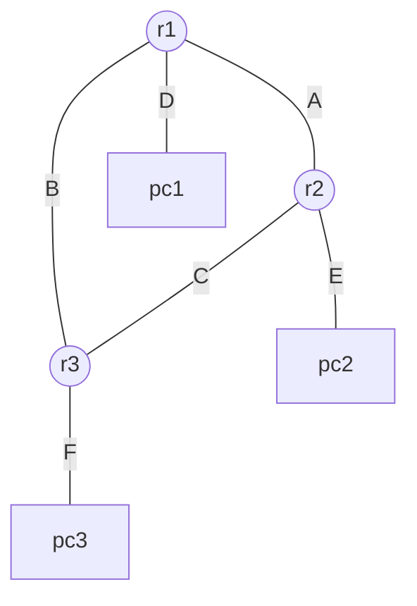

# Lab 14: Dynamic Routing with OSPF

Static routing is incredibly robust, but impossible to manage efficiently at scale. Real backbone networks use dynamic protocols to discover paths natively. In this lab, we will utilize **FRRouting (FRR)** inside our Kathará nodes to activate the **OSPF** (Open Shortest Path First) protocol.

## Topology
A core triangle of routers (`r1`, `r2`, `r3`), each connected downwards to one local PC.



## Setup
Unlike Lab 13, all the rigid IP addressing (`.startup`) and domain wiring (`lab.conf`) is already completely scaffolded for you in this directory. 
The magic happens inside the dedicated structural folders (e.g., `r1/etc/frr/frr.conf`), which Kathará injects natively into the containers!

## Tasks
1. Open `r1/etc/frr/frr.conf`. We provided the first syntax occurrence demonstrating how to activate `router ospf` and advertise a connected `network` specifically into `area 0` (the OSPF backbone area).
2. Complete the `TODO`s in that file to ensure `r1` broadcasts its other two physical interfaces.
3. Apply the identical logical concepts to complete `r2/etc/frr/frr.conf` and `r3/etc/frr/frr.conf` (you will need to create/edit them).
4. Launch the network: `kathara lstart`.
5. Enter the `r1` console. Open the FRR interactive shell by invoking `vtysh`. Run `show ip route`. You should dynamically view remote paths marked with `O` (OSPF) to subnets you absolutely never configured statically!
6. Open `r2`'s terminal. Run a live packet capture dumping to the magical shared `/shared` folder (which maps back to your Host OS): 
   ```bash
   tcpdump -i eth0 -w /shared/ospf_handshake.pcap
   ```
7. Let it run for 15 seconds, and cancel it. Inspect the `.pcap` file using Wireshark locally. You will witness OSPF `Hello` and `Database Description` packets!
