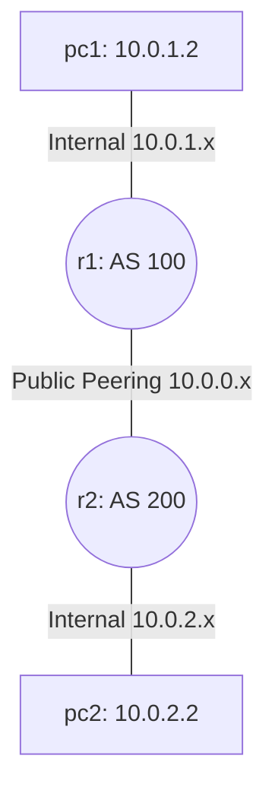

# Lab 15: eBGP Peering (Exterior Gateway Protocol)

If OSPF is used *inside* a network (Interior Gateway Protocol), **BGP (Border Gateway Protocol)** is the absolute glue that builds the internet by connecting completely disparate organizational networks together.
In this lab, we will configure an external BGP (eBGP) peering session between two distinct Autonomous Systems (AS).

## Topology
Two routers (`r1` residing in `AS 100` and `r2` residing in `AS 200`), each proudly announcing their local internal networks to the other across a public peering link.

## Setup
Once again, the domains and static IP `.startup` files are structurally scaffolded for you. Your job is configuring the dynamic BGP logic!

## Tasks
1. We have already provided `r1`'s complete BGP configuration inside `r1/etc/frr/frr.conf`.
2. Open it to witness how `router bgp 100` is initialized, how the internal `network 10.0.1.0/24` is explicitly advertised, and how the `neighbor 10.0.0.2 remote-as 200` peer relationship is strictly defined.
3. Now, create/edit `r2`'s configuration (`r2/etc/frr/frr.conf`)! It should be the exact logical mirror: act as `AS 200`, advertise `10.0.2.0/24`, and point to `r1` (10.0.0.1) as its `AS 100` external peer.
4. You also need to enable the BGP daemon. Open `r2/etc/frr/daemons` (or create it) and set `bgpd=yes`.
5. Run the network: `kathara lstart`.
6. Enter `r1`'s console and run `vtysh`. Use `show ip bgp summary` to see the live peering state. Look at the `State/PfxRcd` column: it should say `1` (indicating 1 prefix received) and NOT be stuck in `Active/Idle`.
7. Ping `10.0.2.2` (`pc2`) strictly from `pc1`. It will flawlessly traverse the internet!
