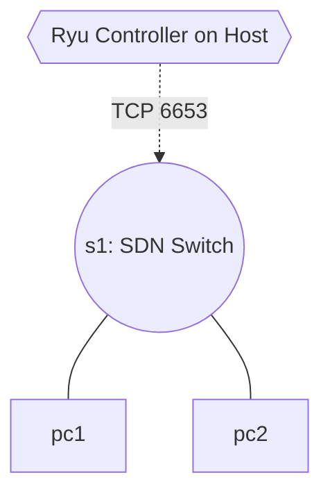

# Lab 16: The Ultimate Sandbox - SDN Integration in Kathará

Until now, we used **Mininet** strictly for OpenFlow, and **Kathará** strictly for traditional IP routing. But what if we want the best of both worlds? What if we want a massive BGP routed architecture where *one specific domain* is controlled by an OpenFlow controller to inject firewall rules dynamically?

Kathará natively provides a specialized docker image called `kathara/sdn` which packages `Open vSwitch` perfectly.

## Topology
A core OpenFlow switch (`s1`) connected to two normal hosts (`pc1`, `pc2`), orchestrated natively by Kathará but controlled by your very own Ryu script.

## Tasks
1. Open `lab.conf`. We provided the unique syntax occurrence indicating how to artificially override the default Kathará Linux image for a specific node using `s1[image]="kathara/sdn"`.
2. Complete the `TODO` to attach the hosts.
3. Open `s1.startup`. We provided the Open vSwitch shell syntax (`ovs-vsctl`) to manually configure `s1` to dial out to an external remote controller spanning your host OS network.
4. Replace `<CONTROLLER_IP>` inside `.startup` with your actual machine's local IP (or the docker network bridge IP if you are running Ryu in a container from Lab 06).
5. On your **Host/Desktop terminal**, start Ryu using the Hub script we made back in Lab 06!
6. Run `kathara lstart`. The switch `s1` will spawn and immediately dial out to Ryu!
7. Try pinging. The OpenFlow logic dictates Kathará's forwarding now!
