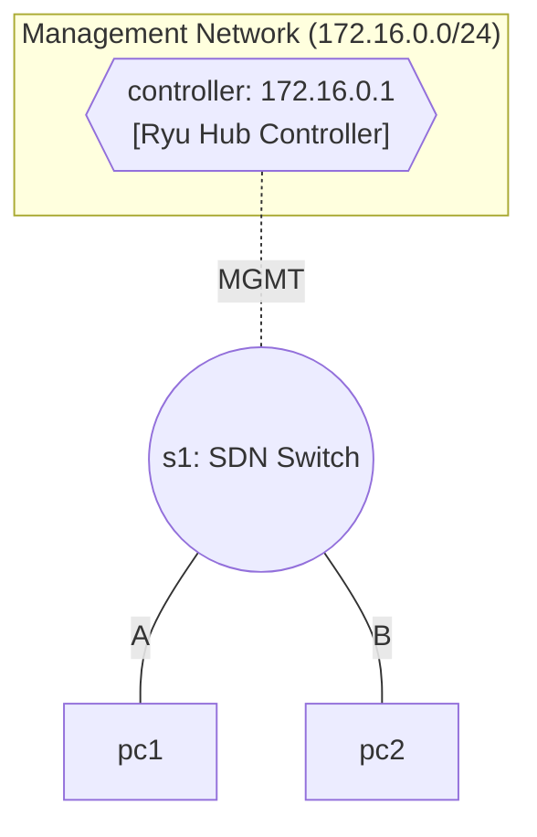

# Lab 16: The Ultimate Sandbox - SDN Integration in Kathará

Until now, we used **Mininet** strictly for OpenFlow, and **Kathará** strictly for traditional IP routing. But what if we want the best of both worlds? What if we want a massive BGP routed architecture where *one specific domain* is controlled by an OpenFlow controller to inject firewall rules dynamically?

Kathará natively provides a specialized docker image called `kathara/sdn` which packages `Open vSwitch` perfectly.

## Topology
A core OpenFlow switch (`s1`) connected to two normal hosts (`pc1`, `pc2`), with a dedicated Ryu controller node on a management network.

```mermaid
graph TD
    subgraph MGMT["Management Network (172.16.0.0/24)"]
        ctrl{{"controller: 172.16.0.1<br/>[Ryu Hub Controller]"}}
    end
    s1((s1: SDN Switch))
    pc1[pc1]
    pc2[pc2]

    ctrl -.-|"MGMT"| s1
    s1 ---|"A"| pc1
    s1 ---|"B"| pc2
```

## Setup (one-time)
Build the controller image (only needed once, shared across all labs):

🖥️ **Host terminal**:
```bash
docker build -t asdn/sdn -f ../docker/Dockerfile.sdn ../docker/
```

## Tasks
1. Open `lab.conf`. We provided the controller node (pre-configured) and the unique syntax for overriding the default Kathará Linux image: `s1[image]="kathara/sdn"`.
2. Complete the `TODO` to attach the hosts.
3. Open `s1.startup`. We provided the Open vSwitch shell syntax (`ovs-vsctl`) to manually configure `s1`. The management interface (`eth2`) and controller connection are pre-configured — you just need to create the OVS bridge and add the data ports.
4. Start the lab:

   🖥️ **Host terminal** (from this lab's directory):
   ```bash
   kathara lstart
   ```
   The controller starts `ryu-manager` automatically. The switch `s1` will connect to it via the management network.
5. From `pc1`'s terminal, try: `ping 10.0.1.1`. The OpenFlow logic dictates Kathará's forwarding now!
