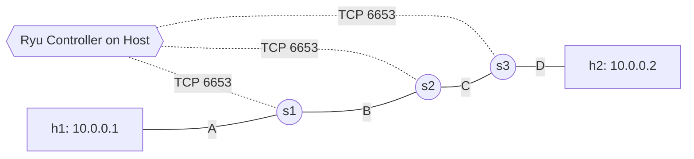

# Lab 17: Multi-Switch SDN Fabric in Kathará

In Lab 16, we used a single SDN switch inside Kathará. But real SDN deployments use **many switches**, all managed by a **single centralized controller**. This is where the true power of SDN shines: one brain orchestrating the entire network.

In this lab, we will build a chain of 3 OpenFlow switches inside Kathará. A single Ryu Learning Switch controller (from Lab 07) will manage all of them simultaneously. Traffic from `h1` to `h2` must traverse **all three switches**, and the controller must learn MAC addresses on each one independently.

## Topology



Traffic path: `h1 → s1 → s2 → s3 → h2`

## Key Concepts
- **Centralized Control**: A single controller can manage dozens of switches. Each switch independently sends `PACKET_IN` messages and receives `FLOW_MOD` rules.
- **Multi-hop L2 Forwarding**: The Learning Switch floods unknown MACs. Since switches are chained, the flood propagates through the entire fabric until the destination is found.
- **Per-switch Flow Tables**: Each switch has its own independent flow table. After the first ping, `ovs-ofctl dump-flows` will show different rules on each switch (because MAC→port mappings differ per switch).

## Setup

1. Make sure [Kathará](https://www.kathara.org/) is installed on your host.
2. On your **host terminal**, start the Ryu Learning Switch controller from Lab 07:
   ```bash
   ryu-manager ../lab07-learning-switch-ryu/ryu_learning_switch.py
   ```
3. In another host terminal, navigate to this lab folder and start the Kathará lab:
   ```bash
   kathara lstart
   ```

## Tasks

### Task 1: Complete the Topology (`lab.conf`)
1. Open `lab.conf`. We provided the full configuration for `s1` (SDN image override + connections to domains A and B).
2. Complete the `TODO`s to define `s2` and `s3` with their respective domain connections and the `kathara/sdn` image override.
3. Connect `h1` to domain A and `h2` to domain D.

### Task 2: Configure the Switches (`.startup` files)
1. Open `s1.startup`. It contains the complete OVS setup: starting the daemon, creating the bridge, adding ports, and connecting to the remote controller.
2. Open `s2.startup` and `s3.startup`. Complete the `TODO`s following the exact same pattern as `s1.startup`. Each switch must:
   - Start the OVS daemon
   - Create a bridge with the **same name as the node** (e.g., `s2` for the s2 node)
   - Add its interfaces (`eth0`, `eth1`) to the bridge
   - Point to the **same** remote controller
3. Replace `<CONTROLLER_IP>` in all `.startup` files with your host machine's IP address.

> **Tip:** On Linux, use `ip route get 1 | awk '{print $7}'` to find your host IP. On macOS, use `ipconfig getifaddr en0`.

### Task 3: Verification
1. From `h1`'s Kathará terminal, ping `h2`:
   ```bash
   ping 10.0.0.2
   ```
2. Watch the Ryu controller terminal — you should see `PACKET_IN` events from **three different datapaths** (s1, s2, s3). The controller learns MACs on each switch independently.
3. From any switch terminal (e.g., `s2`), inspect the installed flow rules:
   ```bash
   ovs-ofctl dump-flows s2
   ```
   You should see rules with specific `dl_dst` (destination MAC) entries and corresponding `output:N` actions — proving that the Learning Switch has programmed hardware-level rules on each switch.

### Task 4 (Advanced): Observe the Flood Chain
1. Open `h2`'s terminal and start a packet capture:
   ```bash
   tcpdump -i eth0
   ```
2. From `h1`, ping a **non-existent** IP (e.g., `ping 10.0.0.99`). Since no host has that IP, the ARP request will flood through the entire s1→s2→s3 chain. You should see the ARP request arriving on `h2`'s capture, proving that FLOOD traverses the whole fabric.
