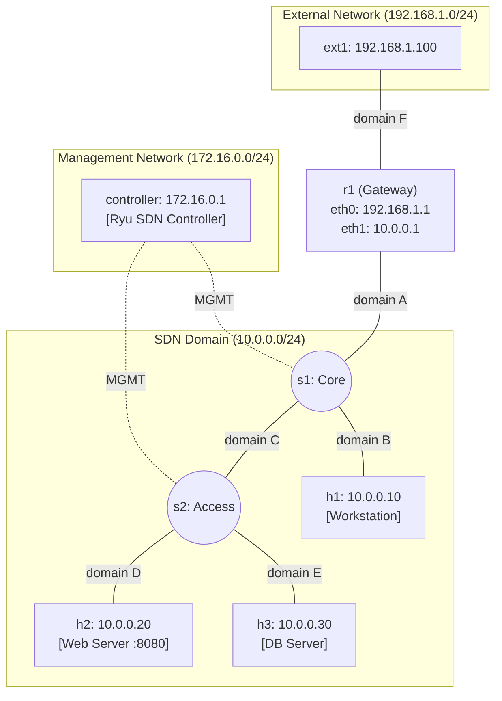

# Lab 18: Exam Playground — Enterprise SDN Network

This lab is a **fully configured, working SDN network**. There are no TODOs to complete. Your job is to **study the topology, understand every component**, and be ready for the exam.

During the exam, you will be asked to either:
- 🔧 **Troubleshoot** a broken network (we will deliberately break something)
- 🆕 **Implement** a new feature (e.g., firewall rules, new hosts, ACLs)
- 🔍 **Analyze** traffic patterns and explain network behavior

---

## Topology

```
            [External Network: 192.168.1.0/24]

                ext1 (192.168.1.100)
                  |
              r1 (Gateway)
         192.168.1.1 | 10.0.0.1
                  |
          ┌───── s1 (Core Switch) ──────┐
          │       OVS / OpenFlow        │
          │                             │
         h1                    s2 (Access Switch)
     10.0.0.10               OVS / OpenFlow
    [Workstation]            /            \
                           h2              h3
                       10.0.0.20       10.0.0.30
                      [Web Server]    [DB Server]

     Management Network (172.16.0.0/24) — out-of-band
     controller (172.16.0.1) ─── s1 (172.16.0.10) ─── s2 (172.16.0.20)
```



### Network Components

| Node | Role | IP Address | Image | Notes |
|------|------|-----------|-------|-------|
| **controller** | Ryu SDN Controller | `172.16.0.1` (eth0, MGMT) | `asdn/sdn` | Runs `ryu-manager` with the Learning Switch |
| **r1** | Gateway Router | `192.168.1.1` (eth0) / `10.0.0.1` (eth1) | Default (quagga) | IP forwarding enabled, bridges external↔internal |
| **s1** | Core OVS Switch | `172.16.0.10` (eth3, MGMT) | `kathara/sdn` | 3 data ports + 1 management port |
| **s2** | Access OVS Switch | `172.16.0.20` (eth3, MGMT) | `kathara/sdn` | 3 data ports + 1 management port |
| **h1** | Workstation | `10.0.0.10` | Default | General-purpose client |
| **h2** | Web Server | `10.0.0.20` | Default | Runs `python3 -m http.server 8080` |
| **h3** | DB Server | `10.0.0.30` | Default | Simulated database host |
| **ext1** | External Client | `192.168.1.100` | Default | Outside the SDN domain |

### How Traffic Flows

1. **Internal ↔ Internal** (e.g., h1 → h3): Pure L2. The Ryu Learning Switch controller handles MAC learning and flow rule injection on s1 and s2. Traffic flows: `h1 → s1 → s2 → h3`.

2. **External → Internal** (e.g., ext1 → h2): L3 + L2. `ext1` sends to `r1` (its default gateway). `r1` routes the packet to its internal interface (10.0.0.1), which enters the SDN domain via `s1`. The Learning Switch then forwards it to `h2` via `s2`.

3. **Internal → External** (e.g., h1 → ext1): `h1` sends to its default gateway `r1` (10.0.0.1) via the SDN fabric. `r1` routes it out through eth0 to `ext1`.

---

## Setup

### Step 1: Build the Controller Image (one-time)
The controller node uses a custom Docker image (`asdn/sdn`) that includes Ryu. Build it once:

🖥️ **Host terminal** (from this lab's directory):
```bash
docker build -t asdn/sdn -f ../docker/Dockerfile.sdn ../docker/
```

### Step 2: Start the Lab

🖥️ **Host terminal** (from this lab's directory):
```bash
kathara lstart
```
This starts **all nodes** at once: the controller, both switches, the router, and all hosts. The controller runs `ryu-manager` automatically via its startup script. No manual IP configuration needed — the management network uses hardcoded IPs.

### Step 3: Inspect the Flow Tables (before any traffic)
Wait ~5 seconds for all switches to connect to the controller, then examine the flow tables **before sending any traffic**.

#### OVS Port Mapping

Ports are numbered in the order they are added with `ovs-vsctl add-port` (starting from 1):

| Switch | Port 1 (eth0) | Port 2 (eth1) | Port 3 (eth2) |
|--------|--------------|--------------|--------------|
| **s1** | → r1 (uplink) | → h1 | → s2 (trunk) |
| **s2** | → s1 (trunk) | → h2 (web) | → h3 (db) |

Each switch should have **only the table-miss rule** — the default rule installed by the controller when a switch connects. This rule tells the switch: "for any packet you don't have a rule for, send it to the controller."

📦 **s1's Kathara terminal**:
```bash
ovs-ofctl dump-flows s1
```
```
 cookie=0x0, duration=XXs, table=0, n_packets=0, n_bytes=0, priority=0 actions=CONTROLLER:65535
```

📦 **s2's Kathara terminal**:
```bash
ovs-ofctl dump-flows s2
```
```
 cookie=0x0, duration=XXs, table=0, n_packets=0, n_bytes=0, priority=0 actions=CONTROLLER:65535
```

> `priority=0` means lowest priority (matches only if no other rule matches). `CONTROLLER:65535` sends the full packet to the controller via a `PACKET_IN` message.

### Step 4: Verify Connectivity

📦 **h1's Kathara terminal** (internal → internal):
```bash
ping 10.0.0.20    # → h2 (web server)
ping 10.0.0.30    # → h3 (db server)
```

📦 **h1's Kathara terminal** (internal → external):
```bash
ping 192.168.1.100  # → ext1
```

📦 **ext1's Kathara terminal** (external → internal):
```bash
ping 10.0.0.20    # → h2 (web server)
```

📦 **ext1's Kathara terminal** — access the web server:
```bash
curl http://10.0.0.20:8080
```

All pings and the curl should succeed. If they don't, check the controller is running:

📦 **controller's Kathara terminal**:
```bash
ps aux | grep ryu
```

### Step 5: Inspect the Flow Tables (after traffic)

Now check the flow tables again. The controller has learned MAC addresses and installed forwarding rules:

📦 **s1's Kathara terminal**:
```bash
ovs-ofctl dump-flows s1
```
```
 cookie=0x0, duration=XXs, table=0, n_packets=N, n_bytes=N, priority=0 actions=CONTROLLER:65535
 cookie=0x0, duration=XXs, table=0, n_packets=N, n_bytes=N, priority=1,in_port=3,dl_src=MAC_H2,dl_dst=MAC_H1 actions=output:2
 cookie=0x0, duration=XXs, table=0, n_packets=N, n_bytes=N, priority=1,in_port=2,dl_src=MAC_H1,dl_dst=MAC_H2 actions=output:3
```

📦 **s2's Kathara terminal**:
```bash
ovs-ofctl dump-flows s2
```
```
 cookie=0x0, duration=XXs, table=0, n_packets=N, n_bytes=N, priority=0 actions=CONTROLLER:65535
 cookie=0x0, duration=XXs, table=0, n_packets=N, n_bytes=N, priority=1,in_port=2,dl_src=MAC_H2,dl_dst=MAC_H1 actions=output:1
 cookie=0x0, duration=XXs, table=0, n_packets=N, n_bytes=N, priority=1,in_port=1,dl_src=MAC_H1,dl_dst=MAC_H2 actions=output:2
```

> **How to read these rules** (using s1 as an example):
> - **Rule 1** (priority=0): Table-miss — still catches any unknown traffic
> - **Rule 2** (priority=1): "Packets arriving from port 3 (s2 trunk), from h2's MAC to h1's MAC → send out port 2 (h1)." This was learned when h2's ARP reply came back.
> - **Rule 3** (priority=1): "Packets arriving from port 2 (h1), from h1's MAC to h2's MAC → send out port 3 (s2 trunk)." This was learned when h1's first ICMP echo was sent.
>
> Note: `MAC_H1` and `MAC_H2` will be actual MAC addresses like `aa:bb:cc:dd:ee:ff`. Kathará assigns them dynamically.

---

## What You Should Study

Before the exam, make sure you understand:

1. **`lab.conf`** — How collision domains wire the topology. Why does `s1` have 4 interfaces? What is the MGMT domain for? What connects to what?

2. **`.startup` files** — How OVS is initialized: bridge creation, port assignment, controller connection. Why is `eth3` NOT added to the OVS bridge? How IPs and routes are assigned to hosts.

3. **`controller.startup`** & **`controller/ryu_campus.py`** — How the controller starts and how the Learning Switch works: MAC table, flood vs. unicast, flow rule injection. This is the code you may need to modify during the exam.

4. **`r1.startup`** — How the gateway bridges external and internal networks. What happens if IP forwarding is disabled?

5. **`ovs-ofctl`** — How to read and manually add flow rules. This is your primary debugging tool.

---

## Practice Challenges

Use these to prepare. They simulate the style and difficulty of real exam questions.

> **Terminal convention**: Commands like `ovs-ofctl dump-flows s1` run inside **📦 s1's Kathara terminal**. Commands like `ping` on h1 run inside **📦 h1's Kathara terminal**. Commands like `docker compose` or `kathara` run on the **🖥️ Host terminal**.

### 🟢 Level 1: Observation & Analysis
<details>
<summary><b>Challenge 1.1:</b> Trace the path of a packet from ext1 to h3</summary>

List every node and interface the packet traverses. Include L3 (routing) and L2 (switching) decisions at each hop.
</details>

<details>
<summary><b>Challenge 1.2:</b> Examine flow rules after a ping</summary>

Run `h1 ping h3`, then inspect `ovs-ofctl dump-flows s1` and `ovs-ofctl dump-flows s2`. Explain what each rule does and which switch has which rules.
</details>

<details>
<summary><b>Challenge 1.3:</b> What happens if you restart the controller?</summary>

From the **controller's Kathara terminal**, kill the Ryu process (`pkill ryu-manager`) and restart it (`ryu-manager --ofp-tcp-listen-port 6653 /ryu_campus.py &`). Are the old flow rules still on the switches? Try pinging. What do you observe?
</details>

<details>
<summary><b>Challenge 1.4:</b> Observe ARP flooding through the fabric</summary>

On `h3`, run `tcpdump -e -i eth0`. From `h1`, ping `10.0.0.99` (non-existent host). Watch h3's capture. Why does h3 see ARP requests for an IP that has nothing to do with it? What does this tell you about how FLOOD works across a multi-switch fabric?
</details>

<details>
<summary><b>Challenge 1.5:</b> Count and compare flow rules</summary>

Clear all flow rules on both switches (`ovs-ofctl del-flows s1 && ovs-ofctl del-flows s2`), then restart the controller. Run the following sequence: `h1 ping h2`, then `h1 ping h3`, then `ext1 ping h2`. Now count the flow rules on each switch with `ovs-ofctl dump-flows`. Why does s1 have more rules than s2? Which rules are on s1 but not on s2, and why?
</details>

<details>
<summary><b>Challenge 1.6:</b> Understand the table-miss rule</summary>

Run `ovs-ofctl dump-flows s1` right after the lab boots (before any ping). You should see a single flow rule with `priority=0`. What is this rule? What happens if you delete it with `ovs-ofctl del-flows s1`? Try pinging — what happens now, and why?
</details>

### 🟡 Level 2: Modifications
<details>
<summary><b>Challenge 2.1:</b> Add a new host h4 (10.0.0.40) to switch s2</summary>

Modify `lab.conf` to add `h4` connected to a new domain. Create `h4.startup` with the correct IP and default route. Restart the lab and verify h4 can ping all other hosts.
</details>

<details>
<summary><b>Challenge 2.2:</b> Block ICMP between h1 and h3 using ovs-ofctl</summary>

Without modifying the controller, use `ovs-ofctl add-flow` to inject a drop rule on the appropriate switch. Which switch should you target? Verify that h1 can still ping h2 but not h3.
</details>

<details>
<summary><b>Challenge 2.3:</b> Block external access to the DB server</summary>

The DB server (h3) should NOT be reachable from ext1, but internal hosts should still reach it. Implement this using either `ovs-ofctl` or by modifying the Ryu controller.
</details>

<details>
<summary><b>Challenge 2.4:</b> Set up port mirroring on s2</summary>

The security team wants to monitor all traffic going to the web server (h2). Configure OVS port mirroring on `s2` so that all packets destined to h2's port are also copied to h3's port. Use `ovs-vsctl` mirror commands. Verify by running `tcpdump` on h3 while pinging h2 from h1.
</details>

<details>
<summary><b>Challenge 2.5:</b> Expand the network with a new subnet</summary>

Add a second internal subnet `10.0.1.0/24` behind a new switch `s3` (connected to `s1`). Add host `h5` (10.0.1.10) on this new switch. Update `r1` to route between both internal subnets. Verify that h5 can reach h1 and ext1.
</details>

<details>
<summary><b>Challenge 2.6:</b> Allow only HTTP traffic from external to h2</summary>

Using `ovs-ofctl add-flow`, install rules on `s1` that:
- Allow TCP traffic on port 8080 from r1's port to pass through (for external HTTP access)
- Drop all other traffic from r1's port destined to h2's MAC
- Verify: `curl http://10.0.0.20:8080` from ext1 should work, but `ping 10.0.0.20` from ext1 should fail
</details>

<details>
<summary><b>Challenge 2.7:</b> Add a second web server and manual load balancing</summary>

Add host `h5` (10.0.0.50) to s2 and start a web server on it. Using `ovs-ofctl`, install flow rules that send alternating HTTP connections to h2 and h5 (e.g., based on source MAC or IP).
</details>

### 🔴 Level 3: Troubleshooting
<details>
<summary><b>Challenge 3.1:</b> The controller lost connection to s2</summary>

We removed the `ovs-vsctl set-controller` line from `s2.startup`. Without looking at the file, diagnose the problem using `ovs-vsctl show` on s2 and fix it live.
</details>

<details>
<summary><b>Challenge 3.2:</b> ext1 can't reach any internal host</summary>

We disabled IP forwarding on r1. Find the problem and fix it. Hint: `sysctl net.ipv4.ip_forward` and `ping` are your friends.
</details>

<details>
<summary><b>Challenge 3.3:</b> h2's web server is unreachable but pings work</summary>

We stopped the web server process on h2. Diagnose using `curl` and `ss -tlnp`, then restart the service.
</details>

<details>
<summary><b>Challenge 3.4:</b> h3 can ping h2 but not h1 or ext1</summary>

We changed h3's default gateway to `10.0.0.99` (non-existent). h3 can still reach h2 (same L2 segment via s2) but cannot reach anything that requires routing through r1. Diagnose using `ip route show` and fix it live with `ip route`.
</details>

<details>
<summary><b>Challenge 3.5:</b> h2 is completely unreachable from everywhere</summary>

We removed `eth1` from s2's OVS bridge (the port that connects to h2). All other hosts work fine. Use `ovs-vsctl show` on s2 to find the missing port. Re-add it with `ovs-vsctl add-port`.
</details>

<details>
<summary><b>Challenge 3.6:</b> Hosts can ping each other but only after a long delay</summary>

We deleted the table-miss flow rule on s1. The first packet always times out because s1 doesn't know to send unmatched packets to the controller. Diagnose with `ovs-ofctl dump-flows s1` and re-install the table-miss rule manually.
</details>

<details>
<summary><b>Challenge 3.7:</b> Two hosts have the same IP — intermittent connectivity</summary>

We gave h3 the same IP as h2 (10.0.0.20). Pings to 10.0.0.20 sometimes work, sometimes fail, or get responses from the wrong host. Diagnose using `arping` and `ip addr show`, then fix h3's IP.
</details>

### ⚫ Level 4: Development
<details>
<summary><b>Challenge 4.1:</b> Modify the controller to act as a firewall</summary>

Edit `ryu_campus.py` to drop all traffic between h1 (10.0.0.10) and h3 (10.0.0.30). You'll need to parse IPv4 headers (like Lab 09) and add drop rules instead of forwarding rules for matching packets.
</details>

<details>
<summary><b>Challenge 4.2:</b> Implement port-based access control</summary>

Modify the controller so that only HTTP (TCP port 8080) traffic from ext1's subnet (192.168.1.0/24) can reach h2. All other traffic from external should be dropped.
</details>

<details>
<summary><b>Challenge 4.3:</b> Implement a VIP load balancer in the controller</summary>

Create a Virtual IP (10.0.0.100) that distributes traffic across h2 and h3 using round-robin (like Lab 09). When h1 or ext1 pings 10.0.0.100, the controller should rewrite the destination IP to alternate between 10.0.0.20 and 10.0.0.30. Don't forget to handle ARP for the VIP and to rewrite the source IP on return traffic.
</details>

<details>
<summary><b>Challenge 4.4:</b> Add real-time traffic monitoring to the controller</summary>

Enhance `ryu_campus.py` to track and periodically display (every 10 seconds) per-switch statistics: total packets forwarded, total flow rules installed, and the top-3 most active MAC addresses. Use Ryu's `OFPFlowStatsRequest` to poll the switches.
</details>

---

## Cleanup
🖥️ **Host terminal**:
```bash
kathara lclean
```
