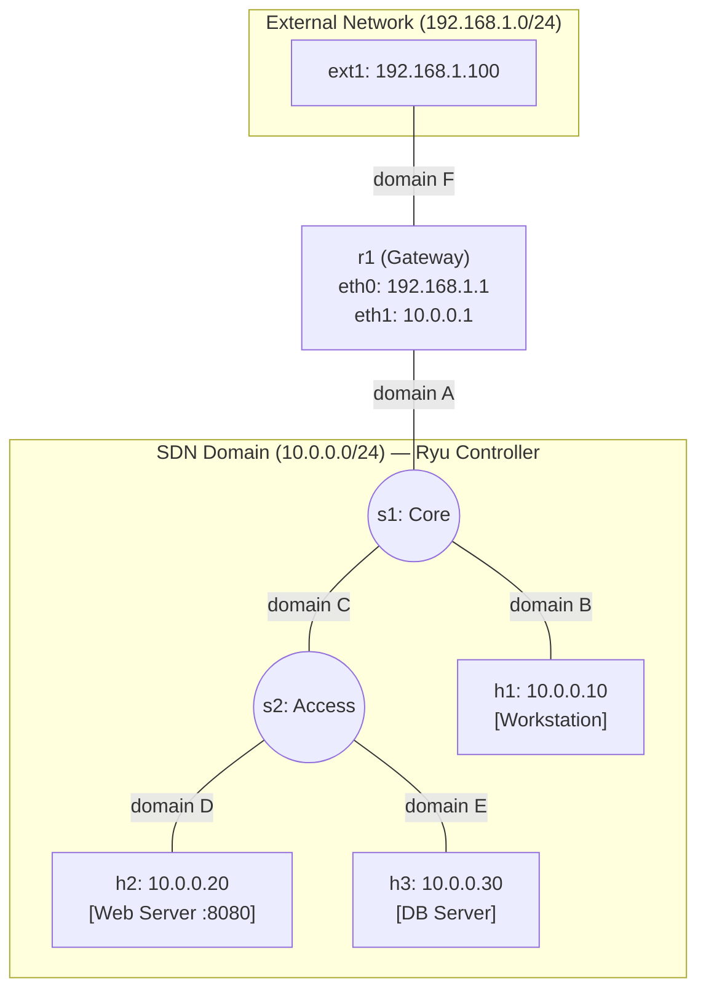

# Lab 18: Exam Playground — Enterprise SDN Network

This lab is a **fully configured, working SDN network**. There are no TODOs to complete. Your job is to **study the topology, understand every component**, and be ready for the exam.

During the exam, you will be asked to either:
- 🔧 **Troubleshoot** a broken network (we will deliberately break something)
- 🆕 **Implement** a new feature (e.g., firewall rules, new hosts, ACLs)
- 🔍 **Analyze** traffic patterns and explain network behavior

---

## Topology

```
            [External Network: 192.168.1.0/24]

                ext1 (192.168.1.100)
                  |
              r1 (Gateway)
         192.168.1.1 | 10.0.0.1
                  |
          ┌───── s1 (Core Switch) ──────┐
          │       OVS / OpenFlow        │
          │                             │
         h1                    s2 (Access Switch)
     10.0.0.10               OVS / OpenFlow
    [Workstation]            /            \
                           h2              h3
                       10.0.0.20       10.0.0.30
                      [Web Server]    [DB Server]
```



### Network Components

| Node | Role | IP Address | Image | Notes |
|------|------|-----------|-------|-------|
| **r1** | Gateway Router | `192.168.1.1` (eth0) / `10.0.0.1` (eth1) | Default (quagga) | IP forwarding enabled, bridges external↔internal |
| **s1** | Core OVS Switch | — | `kathara/sdn` | 3 ports: uplink to r1, downlink to h1, trunk to s2 |
| **s2** | Access OVS Switch | — | `kathara/sdn` | 3 ports: trunk from s1, downlinks to h2 and h3 |
| **h1** | Workstation | `10.0.0.10` | Default | General-purpose client |
| **h2** | Web Server | `10.0.0.20` | Default | Runs `python3 -m http.server 8080` |
| **h3** | DB Server | `10.0.0.30` | Default | Simulated database host |
| **ext1** | External Client | `192.168.1.100` | Default | Outside the SDN domain |

### How Traffic Flows

1. **Internal ↔ Internal** (e.g., h1 → h3): Pure L2. The Ryu Learning Switch controller handles MAC learning and flow rule injection on s1 and s2. Traffic flows: `h1 → s1 → s2 → h3`.

2. **External → Internal** (e.g., ext1 → h2): L3 + L2. `ext1` sends to `r1` (its default gateway). `r1` routes the packet to its internal interface (10.0.0.1), which enters the SDN domain via `s1`. The Learning Switch then forwards it to `h2` via `s2`.

3. **Internal → External** (e.g., h1 → ext1): `h1` sends to its default gateway `r1` (10.0.0.1) via the SDN fabric. `r1` routes it out through eth0 to `ext1`.

---

## Setup

### Step 1: Start the Controller
On your **host terminal**, start the Ryu Learning Switch controller provided with this lab:
```bash
ryu-manager controller/ryu_campus.py
```

### Step 2: Start the Network
In another host terminal, from this lab's directory:
```bash
kathara lstart
```

### Step 3: Verify Connectivity
Wait ~5 seconds for all switches to connect to the controller, then:

From **h1** (internal → internal):
```bash
ping 10.0.0.20    # → h2 (web server)
ping 10.0.0.30    # → h3 (db server)
```

From **h1** (internal → external):
```bash
ping 192.168.1.100  # → ext1
```

From **ext1** (external → internal):
```bash
ping 10.0.0.20    # → h2 (web server)
```

From **ext1**, access the web server:
```bash
curl http://10.0.0.20:8080
```

All pings and the curl should succeed. If they don't, check the controller logs.

### Step 4: Explore
Examine the flow tables on each switch:
```bash
# From s1's terminal:
ovs-ofctl dump-flows s1

# From s2's terminal:
ovs-ofctl dump-flows s2
```

---

## What You Should Study

Before the exam, make sure you understand:

1. **`lab.conf`** — How collision domains wire the topology. Why does `s1` have 3 interfaces? What connects to what?

2. **`.startup` files** — How OVS is initialized: bridge creation, port assignment, controller connection. How IPs and routes are assigned to hosts.

3. **`controller/ryu_campus.py`** — How the Learning Switch works: MAC table, flood vs. unicast, flow rule injection. This is the code you may need to modify during the exam.

4. **`r1.startup`** — How the gateway bridges external and internal networks. What happens if IP forwarding is disabled?

5. **`ovs-ofctl`** — How to read and manually add flow rules. This is your primary debugging tool.

---

## Practice Challenges

Use these to prepare. They simulate the style and difficulty of real exam questions.

### 🟢 Level 1: Observation & Analysis
<details>
<summary><b>Challenge 1.1:</b> Trace the path of a packet from ext1 to h3</summary>

List every node and interface the packet traverses. Include L3 (routing) and L2 (switching) decisions at each hop.
</details>

<details>
<summary><b>Challenge 1.2:</b> Examine flow rules after a ping</summary>

Run `h1 ping h3`, then inspect `ovs-ofctl dump-flows s1` and `ovs-ofctl dump-flows s2`. Explain what each rule does and which switch has which rules.
</details>

<details>
<summary><b>Challenge 1.3:</b> What happens if you restart the controller?</summary>

Stop the Ryu controller (Ctrl+C) and start it again. Are the old flow rules still on the switches? Try pinging. What do you observe?
</details>

### 🟡 Level 2: Modifications
<details>
<summary><b>Challenge 2.1:</b> Add a new host h4 (10.0.0.40) to switch s2</summary>

Modify `lab.conf` to add `h4` connected to a new domain. Create `h4.startup` with the correct IP and default route. Restart the lab and verify h4 can ping all other hosts.
</details>

<details>
<summary><b>Challenge 2.2:</b> Block ICMP between h1 and h3 using ovs-ofctl</summary>

Without modifying the controller, use `ovs-ofctl add-flow` to inject a drop rule on the appropriate switch. Which switch should you target? Verify that h1 can still ping h2 but not h3.
</details>

<details>
<summary><b>Challenge 2.3:</b> Block external access to the DB server</summary>

The DB server (h3) should NOT be reachable from ext1, but internal hosts should still reach it. Implement this using either `ovs-ofctl` or by modifying the Ryu controller.
</details>

### 🔴 Level 3: Troubleshooting
<details>
<summary><b>Challenge 3.1:</b> The controller lost connection to s2</summary>

We removed the `ovs-vsctl set-controller` line from `s2.startup`. Without looking at the file, diagnose the problem using `ovs-vsctl show` on s2 and fix it live.
</details>

<details>
<summary><b>Challenge 3.2:</b> ext1 can't reach any internal host</summary>

We disabled IP forwarding on r1. Find the problem and fix it. Hint: `sysctl net.ipv4.ip_forward` and `ping` are your friends.
</details>

<details>
<summary><b>Challenge 3.3:</b> h2's web server is unreachable but pings work</summary>

We stopped the web server process on h2. Diagnose using `curl` and `ss -tlnp`, then restart the service.
</details>

### ⚫ Level 4: Development
<details>
<summary><b>Challenge 4.1:</b> Modify the controller to act as a firewall</summary>

Edit `ryu_campus.py` to drop all traffic between h1 (10.0.0.10) and h3 (10.0.0.30). You'll need to parse IPv4 headers (like Lab 09) and add drop rules instead of forwarding rules for matching packets.
</details>

<details>
<summary><b>Challenge 4.2:</b> Implement port-based access control</summary>

Modify the controller so that only HTTP (TCP port 8080) traffic from ext1's subnet (192.168.1.0/24) can reach h2. All other traffic from external should be dropped.
</details>

---

## Cleanup
```bash
kathara lclean
```
